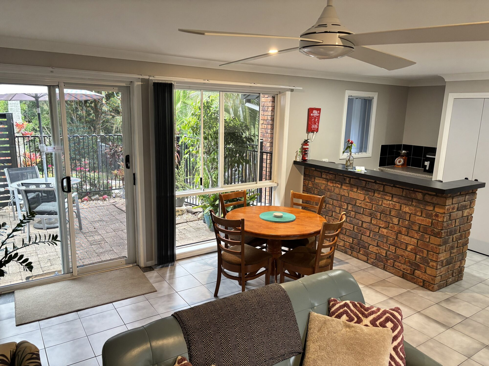

Hillside Villa is our self-contained retreat tucked on the hillside below the main house, with its own private entry and courtyard. It's sized for two, and most of our villa guests are couples marking something — a honeymoon, an anniversary, or simply a quiet weekend away.

Inside, a wood burning fireplace warms the lounge and the kitchenette has everything you need to cook a proper meal for two, with an oven, hob, dishwasher and coffee machine. The queen bedroom has air-conditioning and an overhead fan, and the shower room comes stocked with fresh linen and toiletries.

The private courtyard is yours alone, a spot for morning coffee with the birdsong or a glass of wine under the stars. You're also welcome at the newly renovated inground pool and heated spa (shared facilities), with sun loungers and a view over the valley to the coastline.

Arriving by electric vehicle? Our on-site 7.3 kW Type 2 charger means you can spend the day exploring the mountain's wineries and waterfalls and wake to a fully charged car.

Tamborine Mountain's rainforest walks, wineries and Gallery Walk village are a few minutes' drive away, and the beaches of the Gold Coast are 30 minutes down the mountain.

> “The Villa was spotless, comfortable, with pool, spa and a fantastic view. I would recommend this accommodation to any couple looking for a quiet escape.”
>
> — Federico, Australia

[Book with us](/book/?room_rate=413448)

## Accommodation comprises

- Comfortable Lounge area, well equipped kitchenette with Oven, Hob, Microwave, Dishwasher & Coffee Machine. Kettle, Toaster, utensils, cutlery and crockery provide everything you need.
- Open plan dining area.
- Wood burning fireplace.
- Flat screen TV with Netflix.
- Spacious Queen bedroom sleeps 2, overhead fan and air-conditioning.
- Shower room with fresh linen & toiletries.
- Ironing board and iron.
- Newly renovated sparkling resort style inground pool and heated spa (shared facilities).
- Sun loungers and pool seating (shared facilities).
- Wi-fi throughout property.
- EV charging on site (7.3 kW, Type 2) – fully recharges most vehicles overnight.
- Free private parking on site.

## More ways to stay

## Bringing the family?

Our spacious 3-bedroom Hillside House sleeps up to 6, with a full kitchen, wraparound verandah, and those famous coastal views.

[See Hillside House](/hillside-house/)

## Travelling as a group?

Book the House and Villa together, connected as one retreat sleeping up to 8, with exclusive use of the pool and spa.

[About House & Villa](/house-and-villa/)

## A look around

