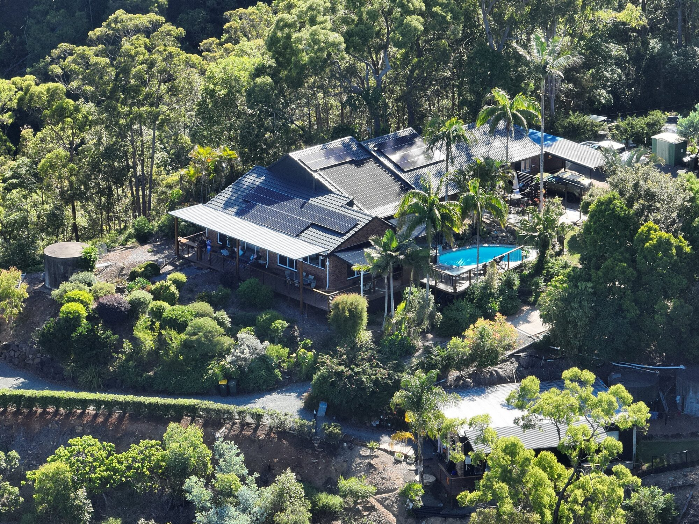

# Visit Tamborine Mountain

Welcome to Tamborine Mountain, a captivating destination nestled in the heart of Queensland's Gold Coast Hinterland. Known for its lush rainforests, stunning vistas, and charming village atmosphere, Tamborine Mountain offers a unique and enchanting escape for travellers seeking natural beauty and relaxation.

**Natural Wonders:** One of the most captivating aspects of Tamborine Mountain is its pristine natural beauty. Explore the lush rainforests of the Tamborine National Park, where you can embark on picturesque bushwalks, discover cascading waterfalls like Curtis Falls, and encounter native wildlife. The Tamborine Skywalk offers a unique treetop perspective, allowing you to walk amidst the canopy and enjoy panoramic views of the surrounding landscape.

**Art and Culture:** Tamborine Mountain boasts a thriving arts and crafts scene. Stroll through the charming village to discover boutique galleries, craft shops, and artisanal products that make for perfect souvenirs. The Tamborine Mountain Heritage Centre provides insights into the area's rich history and indigenous heritage.

**Wine and Dining:** Wine enthusiasts will delight in exploring the local wineries and cellar doors, where you can sample a variety of wines produced in the region. The Tamborine Mountain Distillery offers a unique experience for those interested in craft spirits. The village is also home to a diverse range of restaurants and cafes, serving up delicious cuisine to suit all tastes.

**Adventure and Relaxation:** Whether you're seeking adventure or relaxation, Tamborine Mountain has you covered. Enjoy thrilling experiences like hang gliding, hot air ballooning, and horseback riding. Alternatively, indulge in spa treatments, yoga retreats, or simply unwind in the tranquility of the rainforest.

**Events and Festivals:** Throughout the year, Tamborine Mountain hosts a range of events and festivals celebrating its culture and community. From the Tamborine Mountain Show to the Scarecrow Festival, there's always something happening to add to your itinerary.

Whether you're an outdoor enthusiast, a lover of art and culture, or simply seeking a serene escape, Tamborine Mountain offers a diverse range of experiences that will leave you enchanted and inspired. Plan your visit to this hidden gem and uncover the magic of Tamborine Mountain, where nature, culture, and relaxation converge in perfect harmony.

[Book with us](/book/)
