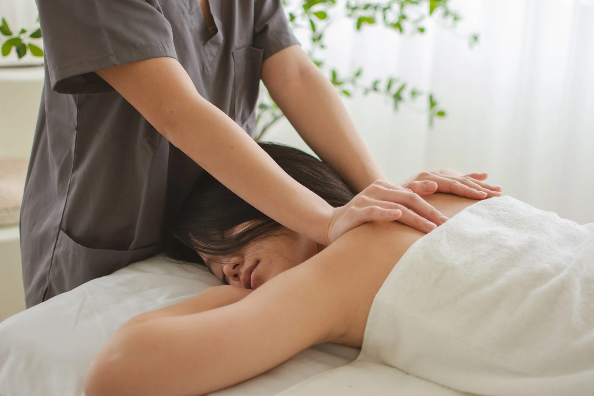

# Mobile Massage

We're delighted to offer a mobile massage service during your stay. Margie and Ben, local massage therapists, bring the table, towels and oils to your accommodation and set up wherever suits you, so the only travel between you and your treatment is a few steps. Choose from the relaxation, therapeutic and beauty menu below, or combine treatments to suit.

